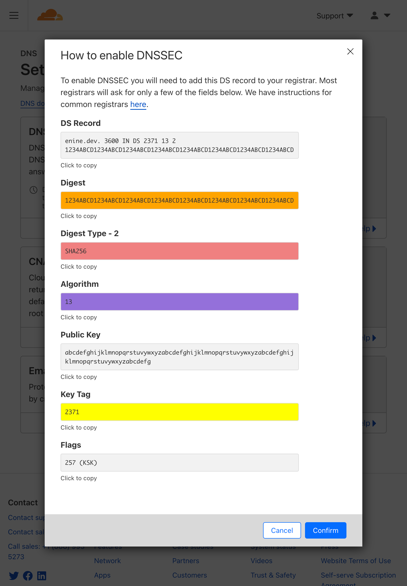
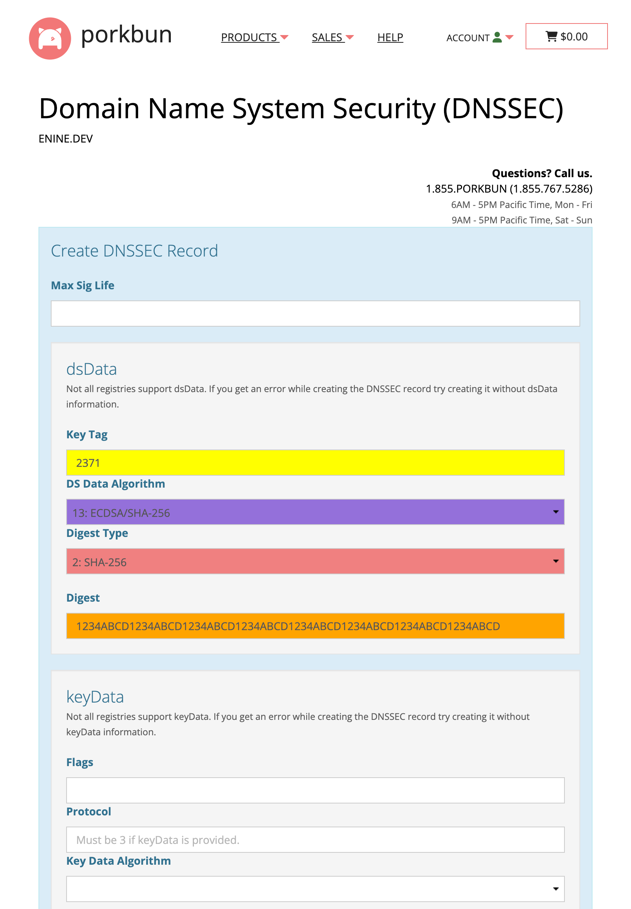

# Domains, DNS, DNSSEC, etc.

##

### DNS Propagation Checker

https://www.whatsmydns.net/

Linking to a domain and DNS Record Type directly

https://www.whatsmydns.net/#&lt;TYPE&gt;/&lt;domain&gt;

Example:

https://www.whatsmydns.net/#NS/enine.dev

## DNSSEC - Cloudflare to porkbun

Cloudflare                 | Porkbun
:-------------------------:|:-----------------------:
 | 

### Verification

https://dnssec-analyzer.verisignlabs.com/

Linking to a domain directly:

https://dnssec-analyzer.verisignlabs.com/\<domainname\>

Example:

https://dnssec-analyzer.verisignlabs.com/enine.dev
