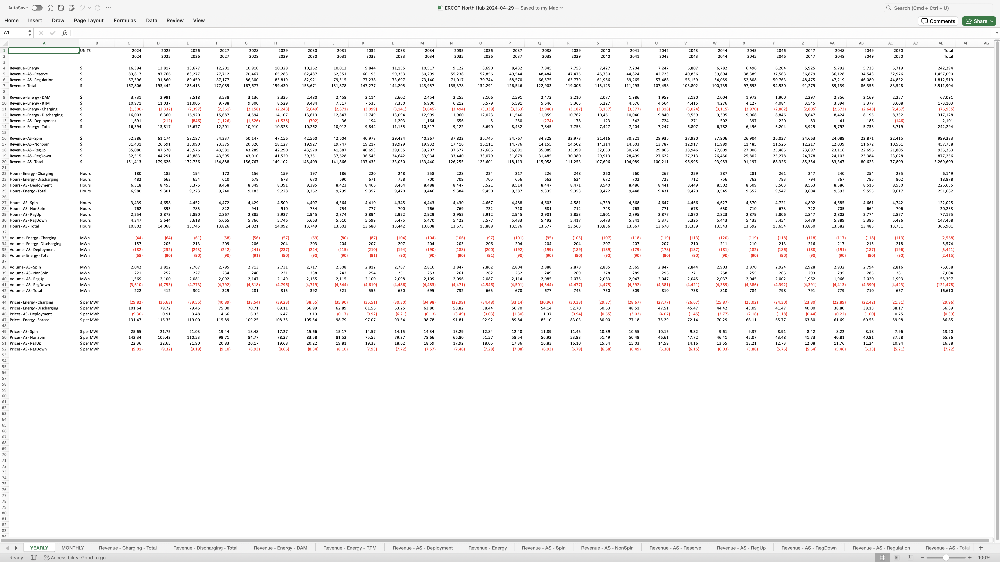

# BESS as Infrastructure

## Table of Contents

- [Introduction](#introduction)
- [Revenue](#revenue)
  - [Modeling](#modeling)
  - [Prices](#prices)
- [Scenario Analysis](#scenario-analysis)
- [Statistical Analysis](#statistical-analysis)
- [Development](#development)
  - [Sample Report](#sample-report)
- [Operation](#operation)
  - [Spot Prices](#spot-prices)
  - [Dispatch](#dispatch-schedule)
  - [Submission](#submission)
  - [Real Time](#real-time-markets)
  - [Fleet Optimization](#fleet-optimization)
- [Risk Management](#risk-management)
  - [Strategies](#strategies)
    - [Fully Contracted Cash Flows](#contracted-cash-flow---toll)
    - [Revenue Puts](#revenue-puts)
    - [Hedging Risk Components](#hedging-risk-components)
  - [Origination](#origination)
  - [Risk Management Policy](#risk-management-policy)
- [Appendix A: Forward Prices](forwards.md)
  

## Introduction

BESS, short for Battery Energy Storage System, is a technology that stores electrical energy for later use. The key components of a BESS include battery cells, a Battery Management System (BMS), Power Conversion Systems (PCS), and often, control systems to manage operation and efficiency.

BESS can both charge and discharge electricity almost instantaneously, giving it remarkable flexibility in a variety of market conditions. This system thrives on volatility in prices and easily adapts to fluctuations in supply and demand. This makes it an invaluable asset on the grid that is experiencing increasingly variable supply and a growing need for flexibility and reliability.

Valuing and operating BESS involves large datasets, extensive computation, and sophisticated analytical tools. 

[Revenue](#revenue) explores the data requirements and methodologies used in the economic valuation and commercial dispatch of BESS. 

## Revenue

BESS can generate revenue from several markets - energy, ancillary services, capacity, and availability - concurrently. Each of these markets has rules and constraints around participating in them.

Modeling BESS requires 
- a valuation model that incorporates the ISO protocols, can perform calculations, and delivers a dispatch schedule for all intervals, and
- prices for every interval in every market considered by the model.

### Modeling

The Knapsack Problem (KP) involves deciding which items to include in a knapsack to maximize the total value without exceeding the weight capacity. Each item has a specific weight and value, and the challenge is to fit the most valuable combination of items into the knapsack without going over the weight limit.

Solving for the most optimal participation in each of these markets to maximize revenue across all available markets in any given interval is a variant of the Knapsack Problem. Like in the KP, the knapsack is the optimal revenue for a given interval, dispatchable volume is the weight, and value is the price in that interval.

Solving for all the intervals in a day is yet another knapsack problem where every interval is an item with a weight (volume) and value (revenue) and is also a knapsack.

The analogy to a KP oversimplifies the problem and doesn't fully capture the dynamic and interdependent nature of optimizing across multiple intervals in a day.

A Mixed Integer Linear Program (MILP) generates a schedule of volumes per market per interval, and which translates to revenue as the sum of the price x volume across all markets and all intervals.

Inputs into the MILP are constraints and prices. Constraints reflect the physical characteristics of the BESS, warranties, the risk management policy, and other strategic commercial decisions.

The MILP, once developed, is a fairly static machine. Input prices into the MILP vary from market to market, interval to interval, and day to day.

Building an MILP is non-trivial. It falls into the category of things that one can hire a quant/PhD to build. Quants build what they understand. They depend on insight from subject matter experts. Real world experience and an understanding of math combine to deliver powerful modeling capabilities.

A typical model supports at least 50 constraints. Some are hard values and are physical limits on the hardware. Others are soft limits and require commercial intuition about where to set those limits.

BatteryOS has engineered the engine to deliver a full revenue forecast in minutes. This is a technical accomplishment with practical implications, including relative value comparisons, scenario modeling, and freedom to pursue any and all opportunities at de minimis incremental cost.

### Prices

Price curves are usually at least hourly; RTM can also be 15 minute and 5 minute price curves, reflecting the structure of the ISO and the dispatchable markets.

Prices incorporate all the assumptions about supply and demand. A revenue forecast and dispatch schedule is only as good as the prices that feed it.

Long-dated forward curves drive the revenue forecast used in the enterprise model and in site selection, while short-term prices drive the actual bid strategy of an asset. 

## Scenario Analysis

In an environment where generating forward curves and running a calculation takes 4 weeks, picking a potential winner becomes important from the get go. Slow processes lead to ambiguous outcomes because the filter for the decision becomes “is it a bad decision?” instead of “is it a good decision?”.

Reducing the time to get a  result from 4 weeks to 4 days to 4 hours to 4 minutes creates an opportunity to run multiple projects and configurations quickly to easily identify the right fit and eliminate the need to commit to an ambiguous outcome because the time to review and re-run is onerous.

## Statistical Analysis

Understanding the value of a location is a combination of understanding the transmission grid, future upgrades, expected changes in the load and supply topology, and modeling prices. A study of volatility, represented more simply by distributions is a quick and easy way to eliminate less attractive locations. Datasets of interest include prices, hi-lo spreads, and locational and temporal basis spreads.

## Development

Backcasting revenue to understand how an asset has performed standalone and vis-a-vis other assets and other locations depends on historically settled prices and on access to historical data. This seemingly easy action is cumbersome without a well defined data architecture that has all the required data -- on hand and on demand.

Forward prices are the key driver of a revenue forecast. They are constructed in several different ways and incorporate the supply stack, futures contract prices, price basis, volatility, hourly shaped price scalars, and the interconnection queue.

Forecasting revenue is achieved by employing the same MILP and applying forward prices to the calculation.

### Is the site good or bad?
The economic “goodness” of a project is the forecasted revenue benchmarked against the historical performance, the reference hub, and the expected performance at alternate sites.

Statistical analysis highlights the volatility of prices at the site and aids in assessing the quality of the performance and the potential for increased revenue.

### Is the site good or bad for me?

Standalone revenue is interesting but not enough. Building and operating BESS is a commercial activity, and considerations like cost of capital, capex, and time to build also matter.

The forecasted revenue is used downstream in the pro-forma and is one part of a larger calculation to determine the viability of the project taking into account all of the factors, including revenue.

### Sample Report

A site report comprises the following information.

- Revenue:
  - Backcast and Forecast chart - showing revenue by curve by year

- Prices
  - Energy 
    - Monthly Block Prices - Historical + Forwards
    - Hi-Lo Spread 
      max(DAM) - min(DAM)
    - Hi-Lo Spread (RTM) 
      max(RTM) - min(RTM)
    - Hi-Lo Spread (DAM+RTM) 
      max(DAM, RTM) - min(DAM, RTM)
  - Ancillary Services
    - Monthly Block Prices - Historical + Forwards
  - Basis:
    - Monthly Block Basis - Historical + Forwards
    - Distribution of hourly basis (DAM)
    - Distribution of hourly basis (RTM)
    - Distribution of hourly basis (DAM+RTM) - lowest lows and highest highs
    - Distribution of Basis Hi-Lo Spread (DAM) 
      max(DAM) - min(DAM)
    - Distribution of Basis Hi-Lo Spread (RTM) 
      max(RTM Basis) - min(RTM Basis)
    - Distribution of Basis Hi-Lo Spread (DAM+RTM) 
      max(DAM Basis, RTM Basis) - min(DAM Basis, RTM Basis)
  - Scalars
    - TBD: 12 monthly charts or heatmap

- Interconnection
  - Capacity build out vs Load growth - historical
  - Planned BESS at POI (or County) vs Planned in Region (Hub)
  - Operating vs Planned - ISO Level Landscape (TBD)

- Cash Flow and Return Metrics:
  - IRR -  10y vs 20y
  - NPV and cash flow

- BOS Index:
  - Index in region vs overall
  - Actual (P25/P50/P75) vs Perfect
  - Index vs Availability
  - Daily index rank

## Operation

Using the same [model](#modeling) described previously, the trading team identifies the price forecasts that look the most likely and generate a dispatch schedule to be submitted to the ISO. The dispatch schedule consists of volumes and price levels that the team has identified as the price levels at which, or better, to buy and sell.

### Spot Prices

Submitting the right schedule in the DA market for energy and ancillary services depends upon a reliable forecast of spot prices across all markets. 

Spot prices are determined by many factors including:
- **Weather**
- **Load**
- **Wind** forecasts &rarr; wind generation
- **Irradiance** forecasts &rarr; solar generation
- **Outages** in the rest of the supply stack

News affects the expected distribution of outcomes. Effectively assessing the impact is still the domain of a human operator. It is also a reason that power trading floors are largely human and not machine.

### Dispatch Schedule

The dispatch schedule reflects the optimal activity charging, discharging, and offering ancillary services, in a 24 hour period that will yield the most revenue while observing all warranty constraints, risk management policies, etc.

### Submission

The optimal dispatch schedule for DAM and Ancillary Services is submitted to the ISO. 

### Real Time Markets

Managing risk in the real time markets has two components - (a) knowing what to do, and (b) a team to execute the plan. And both components can be owned internally, outsourced entirely. Execution costs are fixed and hence overwhelm revenue at a smaller size and underwhelm revenue at scale. Revenue is a function of the size of the fleet.

Single asset and small fleets should outsource everything

Very large fleets should bring everything in house

All fleets in between small and very large maximize return by outsourcing execution and keep responsibility for the commercial decision making internally.

### Fleet Optimization

In markets like ERCOT, it is possible to shift an ancillary services obligation from one asset to another because ancillary services are ISO-wide. Shifting the obligation allows an asset that has an existing AS obligation and is experiencing high prices to shift the AS obligation to an asset experiencing lower prices and capture the value of the high prices by discharging opportunistically.

Deploying strategies like shifting obligations requires that the team (a) understands the ISO protocols for what can be done and how, (b) constantly monitors prices at all constraints and asset sites, and (c) has a process in place to execute on these opportunities as soon as they present themselves. 

> The number of strategies will grow and strategies will evolve over time. This represents a significant differentiator from the best in class and the rest of the marketplace, and is a critical reason for keeping commercial decision making internally and not outsourcing.

## Risk Management

### Strategies

- [Contracted Cash Flow - Toll](#contracted-cash-flow---toll)
- [Revenue Puts](#revenue-puts)
- [Hedging Risk Components](#hedging-risk-components)

#### Contracted Cash Flow - Toll

The simplest way to de-risk an operating asset is to sell a toll on the asset and secure a guaranteed cash flow. There are a growing number of buyers for tolls and so the risk is in the execution, not the availability of the product itself.

#### Revenue Puts

A revenue put is an option structure where the asset owner pays a premium for the right to secure a minimum revenue aggregated over an interval of time, typically a year, if the market fails to provide ample opportunity.

These puts are excellent structures to deliver the hurdle rate on capital while allowing BESS to operate as merchant in optimal market conditions.

#### Hedging Risk Components 

One of the results from running a revenue forecast of BESS is a profile of the volumetric risk to each market for each interval. Those risks can be treated as, and hedged, much like the delta on an option.

Example: If the price-weighted exposure to RRS in a year is 26,280 MWh on a 10MW/20MWh battery, then selling 3MW of the calendar block of RRS hedges the value of the RRS in that revenue calculation. 

### Origination

A solid origination team enables all of the above risk management 

### Risk Management Policy

A good risk management policy describes the immutable rules of engagement without over-prescribing or limiting access to tools and markets that create value within the rules of engagement.

Our framework includes but is not limited to:
- Hedges
  - Hedged volume of the fleet may not be less than zero.
  - Hedged volume of the fleet may not exceed the nameplate `Capacity` x `Duration` limit.
  - All hedges must be pre-approved. Pre-approvals may be for a specified period of time ranging from one day to one month.
  - Pre-approval may be expressed as a range of prices and not limited to a single price to account for the volatility in markets and the opportunities that present themselves without notice.
  - Hedging and unwinding risk in one market with a transaction in another market must be pre-approved.
  - Hedges may be unwound when a significant event caused by weather, supply, demand, or any other reason can cause hedges to incur avoid extraordinary losses and must be pre-approved
  - Describe the process for obtaining pre-approval for hedges, including the responsible party for granting approvals and the documentation required for submission.
  - Describe provisions for monitoring and reporting on hedge performance and compliance with pre-approval conditions.
  - Describe mechanism for periodic review and adjustment of hedge positions based on changing market conditions and business objectives.
- SOC
  - SOC shall not be modeled to be less than zero; Operator will take corrective action immediately when market conditions create a situation that renders SOC below zero (or a limit higher than zero).
  - SOC shall not exceed the nameplate `Capacity` x `Duration`, or a limit expressed as a percentage of the max. Operator will take corrective action immediately when market conditions create a situation that renders SOC above the limit.
- Trading
  - Trading virtuals - buying and selling energy in the same interval - is prohibited.
- Equipment & Warranty 
  - Asset shall be operated within described operating parameters only.
  - Asset shall not violate terms of any warranty on any single day nor cumulatively.
  - Number of cycles annually shall be limited to [Warranty Limit].
  - Describe procedures for tracking and documenting equipment usage, including cycles and operating hours, to ensure compliance with warranty limitations.

## Data Visualization

Aggregating data is necessary to see the forest for the trees, and is relevant to uni-dimensional risks of a solar or wind plant. With storage, it becomes especially important to also drill into the details where aggregations can hide the interplay within a day or within different markets.
